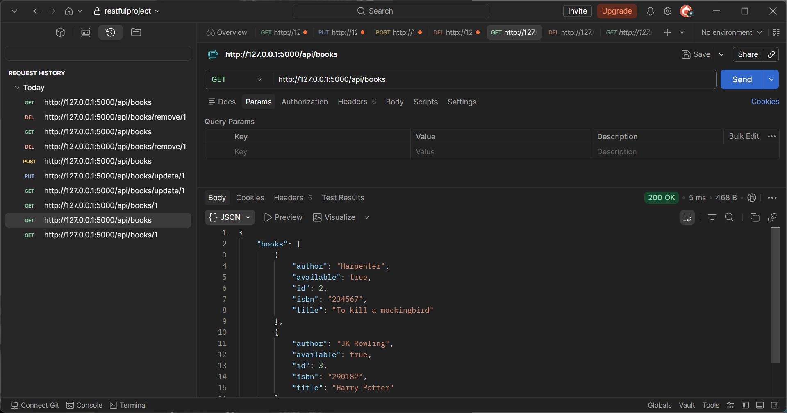
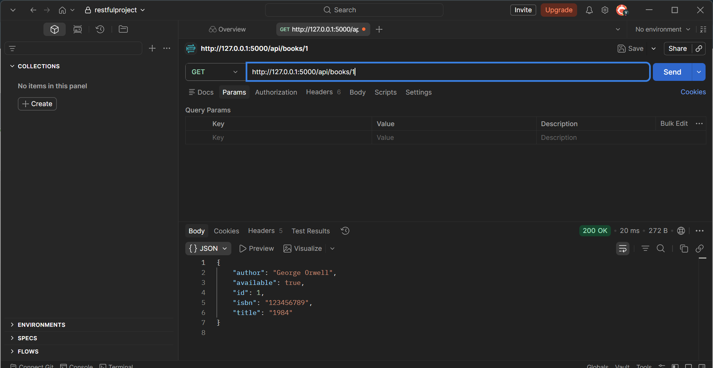
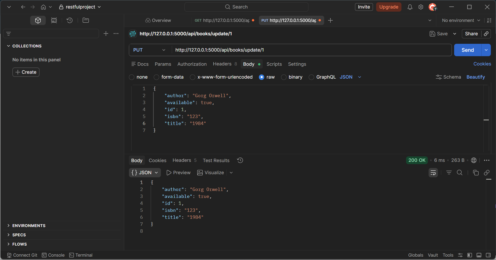
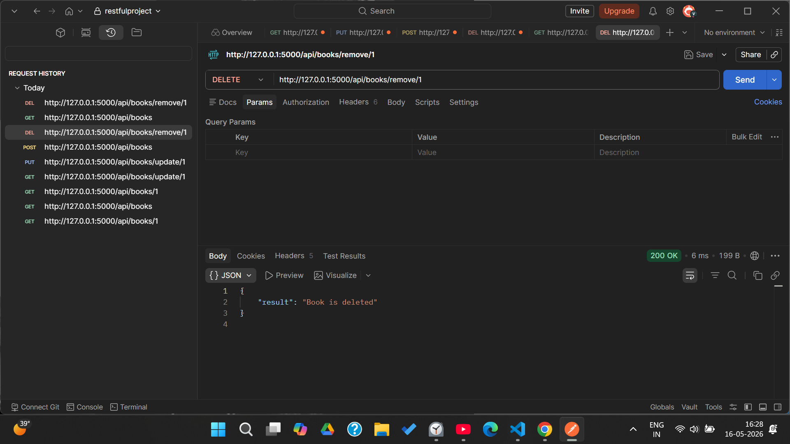

# Flask RESTful Book Management API

A simple REST API built using Flask to manage book data.

## Features
- Get all books
- Get book by ID
- JSON responses
- Error handling

## Tech Stack
- Python
- Flask
- Postman (For testing) 

## API Testing (Postman)

### Get All Books

### Get Book by ID

### Update Book (PUT)

### Delete Book

## Run locally
pip install -r requirements.txt
python app.py
